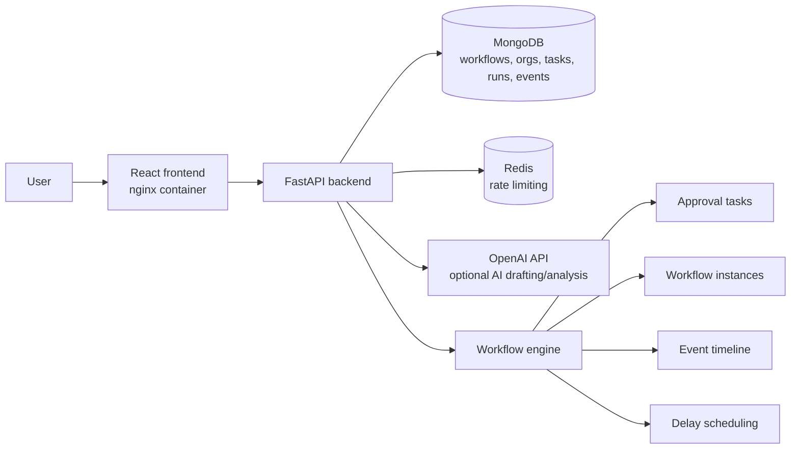

# AI-Assisted Workflow Builder

A visual workflow builder for organization-based approval processes. Users can create workflows with start, approval, condition, delay, and end nodes; validate and activate drafts; run workflow instances; review approval tasks; inspect event history; and optionally draft/analyze workflow graphs with AI.

## Stack

- Backend: FastAPI, Pydantic, MongoDB, Redis, Pytest
- Frontend: React, TypeScript, React Flow, TanStack Query
- Runtime: Docker Compose

## Features

- Authentication with access/refresh tokens
- Organizations with owner/admin/member roles
- Workflow draft editing, validation, activation, inactivation, and deletion
- Role/user-based approval tasks
- Workflow instance runs with event timelines and graph snapshots
- Delay nodes processed by the backend scheduler loop
- Redis-backed rate limiting for auth, write actions, task decisions, instance starts, and AI calls
- Optional AI workflow drafting and graph analysis

## Architecture



## Project Structure

```text
backend/
  app/
    api/       FastAPI routes
    core/      Configuration, security, rate limiting
    db/        MongoDB setup and indexes
    domain/    Business logic and repositories
    engine/    Workflow execution engine
    models/    Domain/database models
    schemas/   API schemas
    workers/   Scheduler worker helpers
  tests/       Backend tests

frontend/
  src/
    api/        API client functions
    app/        App shell and routing
    components/ Shared layout/components
    features/   Feature pages and UI
    lib/        Shared utilities
    styles/     Global CSS
    types/      API/shared TypeScript types
```

## Run with Docker

```powershell
docker compose up --build
```

Then open:

- Frontend: http://localhost:5173
- Backend API: http://localhost:8000
- Health check: http://localhost:8000/api/health

Docker starts:

- `web` - built React app served by nginx
- `api` - FastAPI backend
- `mongo` - MongoDB
- `redis` - Redis for rate limiting

## Environment

Backend defaults live in `backend/.env.example`. Docker Compose uses that file and overrides service URLs for MongoDB and Redis.

For AI features, set:

```env
OPENAI_API_KEY="your-key"
OPENAI_MODEL="gpt-5.4-nano"
```

Rate limiting is enabled in Docker Compose:

```env
RATE_LIMIT_ENABLED=true
RATE_LIMIT_FAIL_OPEN=true
```

For local frontend development, `frontend/.env.example` contains:

```env
VITE_API_BASE_URL="http://localhost:8000"
```

## Local Development

Backend:

```powershell
cd backend
python -m pip install -e ".[dev]"
python -m uvicorn app.main:app --reload --host 127.0.0.1 --port 8000
```

Frontend:

```powershell
cd frontend
npm install
npm run dev
```

Backend tests:

```powershell
cd backend
python -m pytest
```

Frontend build:

```powershell
cd frontend
npm run build
```
