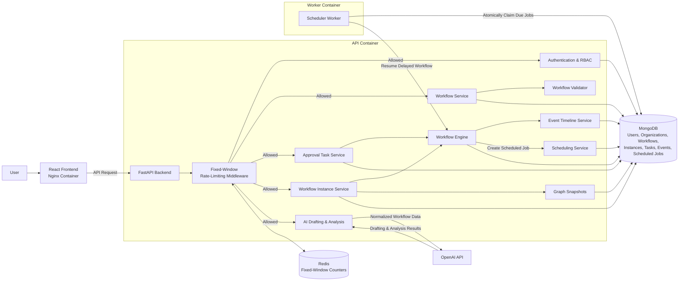

# AI-Assisted Workflow Builder

A visual workflow automation platform for organization-based approval processes. Users can create workflows with start, approval, condition, delay, and end nodes; validate and activate drafts; run workflow instances; review approval tasks; inspect event history; and optionally draft or analyze workflow graphs with AI.

## Stack

* Backend: FastAPI, Pydantic, MongoDB, Redis, Pytest
* Frontend: React, TypeScript, React Flow, TanStack Query
* Runtime: Docker Compose
* Optional AI: OpenAI API

## Features

* Authentication with access and refresh tokens
* Organizations with owner, admin, and member roles
* Workflow draft editing, validation, activation, inactivation, and deletion
* Role- and user-based approval tasks
* Workflow instance runs with event timelines and graph snapshots
* Delay nodes processed by a dedicated scheduler worker
* Redis-backed fixed-window rate limiting for authentication, write actions, task decisions, workflow starts, and AI requests
* Optional AI-assisted workflow drafting and graph analysis

## How It Works

Workflows are built from a small set of node types:

* `start` — begins the workflow
* `condition` — routes based on input or context values
* `approval` — pauses execution until an authorized user approves or rejects
* `delay` — schedules the workflow to continue after a configured duration
* `end` — completes the workflow instance with a result

Draft workflows can be edited and validated before activation. Active workflows can be started as workflow instances.

Each instance stores a graph snapshot, so previous runs can still be viewed against the exact graph they used, even if the original workflow is later changed.

## Permissions

Organizations support three roles:

* Owner — full organization and workflow control
* Admin — workflow and member management, except owner-only destructive actions
* Member — can view organization workflows and act only on approval tasks assigned to them, their role, or everyone

Approval tasks can be assigned to:

* a specific user
* a specific organization role
* owners
* administrators
* anyone in the organization

Owners and administrators can view organization tasks for oversight, but task decisions are still validated by the backend against the task assignment.

## Runs and Tasks

Runs and tasks use backend pagination with Load more controls so large histories are not loaded all at once.

Dashboard cards use backend statistics for real counts, while dashboard preview lists remain intentionally limited.

Task search is handled by the backend, allowing it to find tasks that have not yet been loaded into the browser.

## AI Assistance

AI support is optional. Workflow editing, validation, execution, approvals, delayed jobs, runs, and audit history work without an OpenAI API key.

When `OPENAI_API_KEY` is configured, the workflow detail page can:

* draft a workflow graph from a natural-language prompt
* use the current graph as a starting point
* analyze the current graph and suggest improvements

Generated graphs are validated by the same deterministic workflow validator before they can be saved or activated.

AI does not execute workflows, make approval decisions, or directly modify running instances.

## Architecture



## Project Structure

```text
backend/
  app/
    api/        FastAPI routes
    core/       Configuration, security, and rate limiting
    db/         MongoDB setup and indexes
    domain/     Business logic and repositories
    engine/     Workflow execution engine
    models/     Domain and database models
    schemas/    API schemas
    workers/    Dedicated scheduler worker
  tests/        Backend tests

frontend/
  src/
    api/        API client functions
    app/        App shell and routing
    components/ Shared layout and components
    features/   Feature pages and UI
    lib/        Shared utilities
    styles/     Global CSS
    types/      API and shared TypeScript types
```

## Run with Docker

```powershell
docker compose up --build
```

Then open:

* Frontend: http://localhost:5173
* Backend API: http://localhost:8000
* Health check: http://localhost:8000/api/health

Docker Compose starts:

* `web` — built React application served by Nginx
* `api` — FastAPI backend
* `worker` — dedicated scheduler process for delayed workflow jobs
* `mongo` — MongoDB application storage
* `redis` — Redis fixed-window rate-limit counters

View worker logs:

```powershell
docker compose logs -f worker
```

## Environment

Backend defaults are defined in `backend/.env.example`. Docker Compose uses that file and overrides the MongoDB and Redis service URLs where necessary.

For AI features, configure:

```env
OPENAI_API_KEY="your-key"
OPENAI_MODEL="gpt-5.4-nano"
```

Rate limiting is enabled in Docker Compose:

```env
RATE_LIMIT_ENABLED=true
RATE_LIMIT_FAIL_OPEN=true
```

The scheduler worker polling interval can be configured with:

```env
SCHEDULER_POLL_SECONDS=1
```

For local frontend development, `frontend/.env.example` contains:

```env
VITE_API_BASE_URL="http://localhost:8000"
```

## Local Development

Install backend dependencies:

```powershell
cd backend
python -m pip install -e ".[dev]"
```

Run the backend API:

```powershell
python -m uvicorn app.main:app --reload --host 127.0.0.1 --port 8000
```

Run the scheduler worker in a separate terminal:

```powershell
cd backend
python -m app.workers.scheduler
```

Run the frontend:

```powershell
cd frontend
npm install
npm run dev
```

Run backend tests:

```powershell
cd backend
python -m pytest tests
```

Build the frontend:

```powershell
cd frontend
npm run build
```

## Verifying Delayed Workflows

To verify that delayed workflows are handled by the dedicated worker:

```powershell
docker compose stop worker
```

Start a workflow containing a delay node. The workflow instance should remain waiting after the delay becomes due.

Restart the worker:

```powershell
docker compose start worker
docker compose logs -f worker
```

The worker should claim the overdue scheduled job and resume the workflow instance.

## Known Limitations

* AI drafting and analysis are best-effort and may require manual review before saving.
* Rate limiting uses a fixed-window Redis counter rather than a sliding-window algorithm.
* Scheduled jobs are processed through MongoDB polling rather than a message broker.
* Workflow search is client-side because workflows are loaded per organization; runs and tasks use backend pagination.
* Docker Compose is intended for local development and demonstration rather than hardened production hosting.
