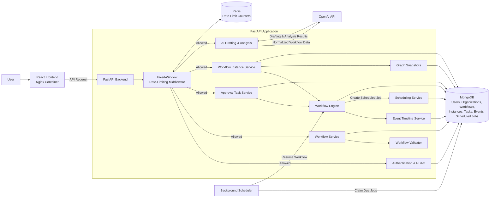

# AI-Assisted Workflow Builder

A visual workflow automation platform for organization-based approval processes.

Users can design workflows with start, approval, condition, delay, and end nodes; validate and activate drafts; run workflow instances; complete assigned approval tasks; inspect execution history; and optionally use AI to draft or analyze workflow graphs.

## Stack

* Backend: FastAPI, Pydantic, MongoDB, Redis, Pytest
* Frontend: React, TypeScript, React Flow, TanStack Query
* Runtime: Docker Compose
* Optional AI: OpenAI API

## Features

* Visual workflow editor built with React Flow
* Authentication with access and refresh tokens
* Organizations with owner, admin, and member roles
* Workflow draft editing, validation, activation, inactivation, and deletion
* Start, condition, approval, delay, and end nodes
* Role- and user-based approval tasks
* Workflow execution with persistent instance state
* Graph snapshots for historical workflow runs
* Event timelines for execution and audit history
* Persistent delayed workflow continuations
* Redis-backed fixed-window rate limiting
* Optional AI-assisted workflow drafting and graph analysis

## How It Works

Workflows are created from a small set of node types:

* `start` — begins the workflow
* `condition` — routes execution based on workflow input or context
* `approval` — pauses execution until an authorized user approves or rejects
* `delay` — schedules execution to continue after a configured duration
* `end` — completes the workflow instance with a result

Draft workflows can be edited and validated before activation. Only active workflows can be started as workflow instances.

Each workflow instance stores a snapshot of the graph it started with. This preserves the exact execution structure used by previous runs, even if the original workflow is changed later.

## Workflow Validation

The backend validates workflow graphs before activation.

Validation includes checks such as:

* exactly one start node
* at least one end node
* unique node and edge identifiers
* valid edge references
* reachable workflow paths
* complete condition branches
* valid approval configuration
* supported graph structure

The deterministic validator remains authoritative even when AI features are enabled.

## Permissions

Organizations support three roles:

* Owner — full organization and workflow control
* Admin — workflow and member management, excluding owner-only actions
* Member — can view organization workflows and act on eligible approval tasks

Approval tasks can be assigned to:

* a specific user
* a specific organization role
* owners
* administrators
* anyone in the organization

Owners and administrators can view organization tasks for oversight, but every approval or rejection is still authorized by the backend against the task assignment.

## Runs and Tasks

Workflow runs and approval tasks use backend pagination so large histories are not loaded into the browser at once.

Dashboard cards use backend statistics for accurate counts, while preview lists remain intentionally limited.

Task search is performed by the backend, allowing users to find tasks that have not yet been loaded into the current page.

Each workflow instance includes an event timeline showing execution activity such as:

* instance creation
* node execution
* approval task creation
* approval or rejection decisions
* delayed execution
* workflow completion
* execution failure

## AI Assistance

AI support is optional. Workflow editing, validation, execution, approvals, delays, runs, and audit history work without an OpenAI API key.

When `OPENAI_API_KEY` is configured, the workflow detail page can:

* draft a workflow graph from a natural-language prompt
* use the current graph as context for a revised draft
* analyze the current graph and suggest improvements

Generated graphs are validated by the same deterministic workflow validator before they can be saved or activated.

AI does not:

* execute workflows
* approve or reject tasks
* activate workflows
* directly modify running workflow instances

## Architecture



## Project Structure

```text
backend/
  app/
    api/        FastAPI routes
    core/       Configuration, security, and rate limiting
    db/         MongoDB setup and indexes
    domain/     Business logic and repositories
    engine/     Workflow execution engine
    models/     Domain and database models
    schemas/    API schemas
    workers/    Background job processing
  tests/        Backend tests

frontend/
  src/
    api/        API client functions
    app/        Application shell and routing
    components/ Shared layout and UI components
    features/   Feature pages and workflow UI
    lib/        Shared utilities
    styles/     Global CSS
    types/      API and shared TypeScript types
```

## Run with Docker

```powershell
docker compose up --build
```

Then open:

* Frontend: http://localhost:5173
* Backend API: http://localhost:8000
* Health check: http://localhost:8000/api/health

Docker Compose starts:

* `web` — built React application served by Nginx
* `api` — FastAPI backend
* `worker` — processes scheduled workflow continuations
* `mongo` — MongoDB application storage
* `redis` — Redis rate-limit counters

View service status:

```powershell
docker compose ps
```

View application logs:

```powershell
docker compose logs -f api
```

View background-processing logs:

```powershell
docker compose logs -f worker
```

Stop the application:

```powershell
docker compose down
```

## Environment

Backend defaults are defined in:

```text
backend/.env.example
```

Docker Compose uses this file and overrides internal MongoDB and Redis service URLs where necessary.

For AI features, configure:

```env
OPENAI_API_KEY="your-key"
OPENAI_MODEL="gpt-5.4-nano"
```

Rate limiting can be configured with:

```env
RATE_LIMIT_ENABLED=true
RATE_LIMIT_FAIL_OPEN=true
```

The scheduled-job polling interval can be configured with:

```env
SCHEDULER_POLL_SECONDS=1
```

For local frontend development:

```env
VITE_API_BASE_URL="http://localhost:8000"
```

Do not commit real API keys, access tokens, passwords, or production secrets.

## Local Development

Local development runs MongoDB and Redis through Docker while the API, background scheduler, and frontend run directly on your machine.

Start MongoDB and Redis:

```powershell
docker compose up -d mongo redis
```

Install backend dependencies:

```powershell
cd backend
python -m pip install -e ".[dev]"
```

Make sure the local backend configuration uses host-accessible service addresses:

```env
MONGODB_URL="mongodb://localhost:27017"
REDIS_URL="redis://localhost:6379/0"
```

Run the backend API:

```powershell
python -m uvicorn app.main:app --reload --host 127.0.0.1 --port 8000
```

Run background processing in another terminal:

```powershell
cd backend
python -m app.workers.scheduler
```

Run the frontend in another terminal:

```powershell
cd frontend
npm install
npm run dev
```

Local URLs:

* Frontend: http://localhost:5173
* Backend API: http://localhost:8000
* Health check: http://localhost:8000/api/health

When the API and background scheduler run inside Docker Compose, they use Docker service hostnames such as `mongo` and `redis`.

When they run directly on your machine, they must use `localhost`.

## Tests

Run backend tests:

```powershell
cd backend
python -m pytest tests
```

Build the frontend:

```powershell
cd frontend
npm run build
```

For an end-to-end delayed workflow test:

1. Create a workflow containing `start`, `delay`, and `end` nodes.
2. Activate and start the workflow.
3. Confirm that the instance enters a waiting state.
4. Confirm that it resumes and completes after the configured delay.

To verify that delayed execution depends on background processing:

```powershell
docker compose stop worker
```

Start a new delayed workflow. It should remain waiting after the delay becomes due.

Restart background processing:

```powershell
docker compose start worker
```

The overdue workflow should then resume.

## Design Decisions

### MongoDB

Workflow graphs contain nested nodes, edges, and configuration objects, making MongoDB suitable for storing workflow definitions and graph snapshots.

Separate collections are used for users, organizations, workflows, instances, tasks, events, and scheduled jobs.

### Deterministic Execution

Workflow execution is handled by deterministic backend logic.

AI is isolated from execution and is used only for optional workflow drafting and analysis.

### Persistent Delays

Delayed workflow continuations are stored in MongoDB. This allows waiting workflow instances to remain recoverable across application restarts.

Due jobs are claimed individually using conditional MongoDB updates.

### Rate Limiting

Redis-backed fixed-window counters protect authentication endpoints, write operations, workflow starts, task decisions, and AI requests.

## Known Limitations

* AI drafting and analysis are best-effort and may require manual review.
* Rate limiting uses a fixed-window counter rather than a sliding-window algorithm.
* Scheduled workflow continuations use MongoDB polling rather than a message broker.
* Workflow search is client-side because workflows are loaded per organization.
* Runs and tasks use backend pagination.
* Docker Compose is intended for local development and demonstration rather than hardened production deployment.
