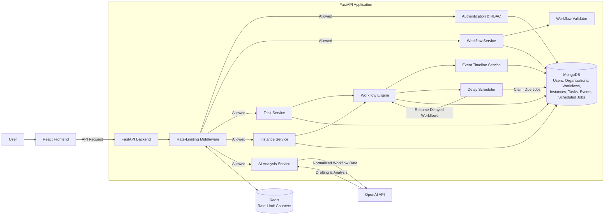

# AI-Assisted Workflow Builder

A visual workflow builder for organization-based approval processes. Users can create workflows with start, approval, condition, delay, and end nodes; validate and activate drafts; run workflow instances; review approval tasks; inspect event history; and optionally draft/analyze workflow graphs with AI.

## Stack

- Backend: FastAPI, Pydantic, MongoDB, Redis, Pytest
- Frontend: React, TypeScript, React Flow, TanStack Query
- Runtime: Docker Compose

## Features

- Authentication with access/refresh tokens
- Organizations with owner/admin/member roles
- Workflow draft editing, validation, activation, inactivation, and deletion
- Role/user-based approval tasks
- Workflow instance runs with event timelines and graph snapshots
- Delay nodes processed by the backend scheduler loop
- Redis-backed rate limiting for auth, write actions, task decisions, instance starts, and AI calls
- Optional AI workflow drafting and graph analysis

## How It Works

Workflows are built from a small set of node types:

- `start` - begins the workflow
- `condition` - routes based on input/context values
- `approval` - pauses execution until an authorized user approves or rejects
- `delay` - waits for a configured duration before continuing
- `end` - completes the instance with a result

Draft workflows can be edited and validated before activation. Active workflows can be started as workflow instances. Each instance stores a graph snapshot, so older runs can still be viewed against the graph version they actually used.

## Permissions

Organizations support three roles:

- Owner - full organization and workflow control
- Admin - workflow/member management, except owner-only destructive actions
- Member - can view org workflows and act only on approval tasks assigned to them, their role, or everyone

Approval tasks can be assigned to a specific user, a specific role, Owner or Admin, or anyone in the organization. Owners/Admins can view org tasks for oversight, but task approval is still checked by the backend against the task assignment.

## Runs and Tasks

Runs and tasks are paginated with Load more buttons so large histories do not load all at once. Dashboard cards use backend stats for real counts, while dashboard preview lists stay intentionally small.

Task search runs on the backend, so it can find tasks that have not been loaded into the browser yet.

## AI Assistance

AI support is optional. When `OPENAI_API_KEY` is configured, the workflow detail page can:

- draft a graph from a natural-language prompt
- use the current graph as a starting point
- analyze the current graph and suggest improvements

Generated graphs are still validated by the same deterministic workflow validator before they can be saved/activated.

## Architecture



## Project Structure

```text
backend/
  app/
    api/       FastAPI routes
    core/      Configuration, security, rate limiting
    db/        MongoDB setup and indexes
    domain/    Business logic and repositories
    engine/    Workflow execution engine
    models/    Domain/database models
    schemas/   API schemas
    workers/   Scheduler worker helpers
  tests/       Backend tests

frontend/
  src/
    api/        API client functions
    app/        App shell and routing
    components/ Shared layout/components
    features/   Feature pages and UI
    lib/        Shared utilities
    styles/     Global CSS
    types/      API/shared TypeScript types
```

## Run with Docker

```powershell
docker compose up --build
```

Then open:

- Frontend: http://localhost:5173
- Backend API: http://localhost:8000
- Health check: http://localhost:8000/api/health

Docker starts:

- `web` - built React app served by nginx
- `api` - FastAPI backend
- `mongo` - MongoDB
- `redis` - Redis for rate limiting

## Environment

Backend defaults live in `backend/.env.example`. Docker Compose uses that file and overrides service URLs for MongoDB and Redis.

For AI features, set:

```env
OPENAI_API_KEY="your-key"
OPENAI_MODEL="gpt-5.4-nano"
```

Rate limiting is enabled in Docker Compose:

```env
RATE_LIMIT_ENABLED=true
RATE_LIMIT_FAIL_OPEN=true
```

For local frontend development, `frontend/.env.example` contains:

```env
VITE_API_BASE_URL="http://localhost:8000"
```

## Local Development

Backend:

```powershell
cd backend
python -m pip install -e ".[dev]"
python -m uvicorn app.main:app --reload --host 127.0.0.1 --port 8000
```

Frontend:

```powershell
cd frontend
npm install
npm run dev
```

Backend tests:

```powershell
cd backend
python -m pytest
```

Frontend build:

```powershell
cd frontend
npm run build
```

## Known Limitations

- AI drafting is best-effort and may require manual review/editing before saving.
- Rate limiting uses a fixed-window Redis counter, not a sliding-window algorithm.
- The scheduler currently runs inside the FastAPI process instead of a separate worker container.
- Workflow search is client-side because workflows are loaded per organization; runs/tasks use backend pagination.
- Docker Compose is intended for local/demo deployment, not hardened production hosting.
