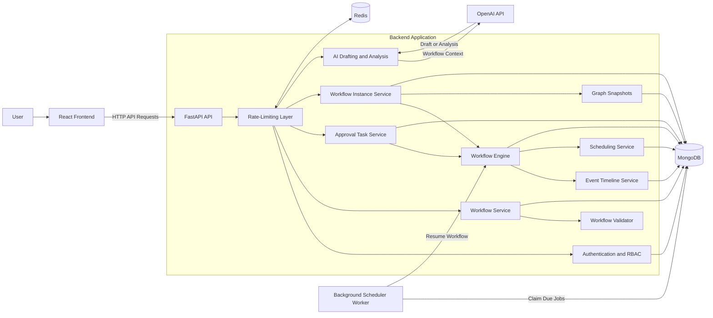

# AI-Assisted Workflow Builder

[](https://github.com/ErenKarakus1/AI-Assisted-Workflow-Builder/actions/workflows/ci.yml)

[](LICENSE)


A full-stack visual workflow automation platform for organization-based approval processes.

Users can design workflows with start, condition, approval, delay, and end nodes; validate and activate workflow drafts; run workflow instances; complete assigned approval tasks; inspect execution history; and optionally use AI to draft or analyze workflow graphs.

## Tech Stack

### Backend

* FastAPI
* Pydantic
* MongoDB
* Redis
* Pytest

### Frontend

* React
* TypeScript
* React Flow
* TanStack Query
* React Hook Form
* Vite

### Infrastructure

* Docker
* Docker Compose

### Optional AI Integration

* OpenAI API

## Features

* Visual workflow editor
* Organization-based access control
* Owner, admin, and member roles
* Access-token and refresh-token authentication
* Automatic access-token renewal and authenticated-request retry
* Workflow draft creation and editing
* Deterministic workflow graph validation
* Workflow activation and inactivation
* Workflow instance execution
* Role-based and user-based approval tasks
* Persistent delayed workflow execution
* Background scheduler worker
* Workflow graph snapshots
* Execution and audit event timelines
* Paginated workflow runs and approval tasks
* Backend task search
* Redis-backed rate limiting
* Optional AI-assisted workflow drafting and analysis
* Dockerized local setup
* 61 passing backend tests
* Reusable workflow templates

## How It Works

Workflows are built from five node types:

* `start` — begins the workflow
* `condition` — chooses a path based on workflow input context
* `approval` — pauses execution until an authorized user approves or rejects
* `delay` — pauses execution for a configured duration
* `end` — completes the workflow instance with a result

A workflow begins as a draft. Draft workflows can be edited and validated before activation.

Only active workflows can be started as workflow instances.

Each workflow instance stores a snapshot of the graph used when the instance starts. This ensures that previous runs preserve their original execution structure even if the workflow definition is edited later.

## Workflow Validation

Workflow graphs are validated by deterministic backend logic before activation.

Validation includes checks for:

* Exactly one start node
* At least one end node
* Unique node identifiers
* Unique edge identifiers
* Valid edge references
* Reachable workflow paths
* Complete condition branches
* Valid approval assignments
* Valid delay configuration
* Supported graph structure

AI-generated workflows pass through the same deterministic validator as manually created workflows.

AI suggestions never replace backend validation.

## Organizations and Permissions

Organizations support three roles.

### Owner

Owners have full control over the organization, its members, and its workflows.

### Admin

Admins can manage workflows and organization members, except for owner-only operations.

### Member

Members can view organization workflows and act on approval tasks assigned to them, their role, or everyone in the organization.

Approval tasks can be assigned to:

* A specific user
* A specific organization role
* Owners
* Administrators
* Any organization member

Owners and administrators can view organization tasks for oversight. However, every approval or rejection is still authorized by the backend against the task assignment.

## Workflow Runs and Tasks

Workflow runs and approval tasks use backend pagination so large histories are not loaded into the browser at once.

Dashboard cards use backend statistics for accurate totals, while preview lists remain intentionally limited.

Task search is handled by the backend, allowing users to find tasks that have not yet been loaded into the current page.

Each workflow instance contains an event timeline that can include:

* Instance creation
* Node execution
* Condition evaluation
* Approval task creation
* Approval decisions
* Rejection decisions
* Delay scheduling
* Delayed execution resumption
* Workflow completion
* Execution failure

## Delayed Execution

Delay nodes create persistent scheduled jobs in MongoDB.

A separate background worker polls for due jobs, claims them using conditional database updates, and resumes the corresponding workflow instances.

Because delayed jobs are persisted, waiting workflows can survive application restarts.

## AI Assistance

AI support is optional.

Workflow editing, validation, activation, execution, approvals, delays, runs, and audit history work without an OpenAI API key.

When `OPENAI_API_KEY` is configured, the workflow detail page can:

* Draft a workflow graph from a natural-language prompt
* Use the current graph as context for a revised draft
* Analyze the current graph
* Suggest workflow improvements

Generated graphs are normalized and validated by the deterministic workflow validator before they can be saved or activated.

AI cannot:

* Activate workflows
* Execute workflows
* Approve tasks
* Reject tasks
* Modify running workflow instances
* Override authorization checks

## Architecture



## Project Structure

```text
backend/
  app/
    api/          FastAPI routes
    core/         Configuration, security, and rate limiting
    db/           MongoDB setup and indexes
    domain/       Business logic and repositories
    engine/       Workflow execution engine
    models/       Domain and database models
    schemas/      Request and response schemas
    workers/      Background scheduler
  tests/          Backend test suite

frontend/
  src/
    api/          API client functions
    app/          Application setup and shell
    components/   Shared layout and UI components
    features/     Feature pages and workflow UI
    lib/          Shared utilities
    routes/       Protected routing
    styles/       Global styles
    types/        API and shared TypeScript types
```

## Requirements

### Docker Setup

* Docker
* Docker Compose

### Local Development

* Python 3.12 or newer
* Node.js 22 or newer
* npm
* Docker, or locally installed MongoDB and Redis

## Run with Docker

### 1. Clone the repository

```bash
git clone https://github.com/ErenKarakus1/AI-Assisted-Workflow-Builder.git
cd AI-Assisted-Workflow-Builder
```

### 2. Create the backend environment file

Copy the provided example configuration.

Linux and macOS:

```bash
cp backend/.env.example backend/.env
```

Windows PowerShell:

```powershell
Copy-Item backend/.env.example backend/.env
```

Review `backend/.env` and update any values you want to customize.

A valid OpenAI API key is required only for the optional AI features.

### 3. Start the application

```bash
docker compose up --build
```

Open:

* Frontend: http://localhost:5173
* Backend API: http://localhost:8000
* Health check: http://localhost:8000/api/health

Docker Compose starts:

* `web` — React frontend
* `api` — FastAPI backend
* `worker` — background scheduler for delayed workflows
* `mongo` — MongoDB database
* `redis` — Redis rate-limit storage

### Stop the application

```bash
docker compose down
```

### Stop the application and remove stored data

```bash
docker compose down -v
```

This removes the MongoDB and Redis volumes created by Docker Compose.

## Environment Configuration

### Backend

The backend environment template is located at:

```text
backend/.env.example
```

Create your local configuration at:

```text
backend/.env
```

Docker Compose loads `backend/.env` for both the API and scheduler worker.

The Compose configuration overrides `MONGODB_URL` and `REDIS_URL` with Docker service hostnames, allowing the containers to communicate with the `mongo` and `redis` services.

#### Application configuration

```env
APP_NAME="AI-Assisted Workflow Builder API"
APP_VERSION="0.1.0"
ENVIRONMENT="development"
```

#### CORS configuration

```env
CORS_ORIGINS='["http://localhost:5173","http://127.0.0.1:5173"]'
```

#### Database configuration

For backend processes running directly on your machine:

```env
MONGODB_URL="mongodb://localhost:27017"
MONGODB_DATABASE="workflow_builder"
REDIS_URL="redis://localhost:6379/0"
```

When the API and worker run through Docker Compose, these URLs are overridden with:

```text
mongodb://mongo:27017
redis://redis:6379/0
```

#### Rate-limiting configuration

```env
RATE_LIMIT_ENABLED=false
RATE_LIMIT_FAIL_OPEN=true
```

Docker Compose enables rate limiting for the containerized API.

When `RATE_LIMIT_FAIL_OPEN` is enabled, requests are allowed if Redis is temporarily unavailable.

#### Scheduler configuration

```env
SCHEDULER_POLL_SECONDS=1
```

This controls how frequently the background worker checks for due scheduled jobs.

#### AI configuration

```env
OPENAI_API_KEY=""
OPENAI_MODEL="gpt-5.4-nano"
```

Leave `OPENAI_API_KEY` empty when AI features are not needed.

#### Authentication configuration

```env
JWT_SECRET_KEY="change-me-in-production-with-a-long-random-secret"
JWT_ALGORITHM="HS256"
ACCESS_TOKEN_MINUTES=15
REFRESH_TOKEN_DAYS=30
```

The example JWT secret is intended only for local development. Replace it with a long, randomly generated secret for any deployed environment.

### Frontend

The frontend environment template is located at:

```text
frontend/.env.example
```

For local frontend development:

```env
VITE_API_BASE_URL="http://localhost:8000"
```

Do not commit `backend/.env`, `frontend/.env`, or any real API keys, access tokens, passwords, or production secrets.

Only `.env.example` templates should be committed.

## Local Development

The recommended local-development setup runs MongoDB and Redis through Docker while the API, worker, and frontend run directly on your machine.

### 1. Start MongoDB and Redis

From the repository root:

```bash
docker compose up -d mongo redis
```

### 2. Create the backend environment file

Linux and macOS:

```bash
cp backend/.env.example backend/.env
```

Windows PowerShell:

```powershell
Copy-Item backend/.env.example backend/.env
```

The example file uses host-accessible URLs:

```env
MONGODB_URL="mongodb://localhost:27017"
REDIS_URL="redis://localhost:6379/0"
```

Docker Compose overrides these values when the API and worker run inside containers.

### 3. Install backend dependencies

```bash
cd backend
python -m pip install -e ".[dev]"
```

### 4. Start the backend API

From the `backend` directory:

```bash
python -m uvicorn app.main:app --reload --host 127.0.0.1 --port 8000
```

### 5. Start the scheduler worker

Open another terminal:

```bash
cd backend
python -m app.workers.scheduler
```

### 6. Install frontend dependencies

Open another terminal:

```bash
cd frontend
npm install
```

### 7. Start the frontend

```bash
npm run dev
```

Open:

* Frontend: http://localhost:5173
* Backend API: http://localhost:8000
* Health check: http://localhost:8000/api/health

## Tests and Checks

### Backend tests

The backend test suite currently contains **61 passing tests**.

```bash
cd backend
python -m pytest
```

The test suite covers areas including:

* Authentication
* Organizations and permissions
* Workflow management
* Workflow validation
* Workflow execution
* Approval tasks
* Delayed scheduling
* Rate limiting
* Health checks

### Frontend checks

```bash
cd frontend
npm install
npm run lint
npm run build
```


## Design Decisions

### Deterministic Workflow Execution

Workflow execution is handled by deterministic backend logic.

AI is isolated from workflow execution and is used only for optional drafting and analysis.

### MongoDB

Workflow graphs contain nested nodes, edges, and configuration objects. MongoDB supports storing these graph definitions and snapshots without splitting every graph component across many relational tables.

Separate collections are used for:

* Users
* Organizations
* Workflows
* Workflow instances
* Approval tasks
* Events
* Scheduled jobs

### Graph Snapshots

Each workflow instance stores the graph used when the instance starts.

This allows historical runs to preserve their original execution structure even after the workflow definition changes.

### Backend Authorization

Authorization for workflow management and task decisions is enforced by the backend.

Frontend visibility rules improve the user experience but do not replace server-side permission checks.

### Persistent Scheduling

Delayed workflow continuations are stored as scheduled jobs in MongoDB.

This allows waiting workflow instances to remain recoverable across API and worker restarts.

The worker claims due jobs using conditional database updates before processing them.

### Rate Limiting

Redis-backed fixed-window counters protect sensitive or resource-intensive endpoints, including:

* Authentication operations
* Write operations
* Workflow instance starts
* Approval decisions
* AI requests

## Known Limitations

* AI drafting and analysis are best-effort and may require manual review.
* Authentication tokens are stored in browser local storage. A production-oriented design could instead use an HttpOnly, Secure, SameSite refresh-token cookie.
* Rate limiting uses a fixed-window counter rather than a sliding-window or token-bucket algorithm.
* IP-based rate limiting uses the directly connected client address and requires trusted proxy-header configuration when deployed behind a reverse proxy.
* Scheduled jobs use MongoDB polling rather than a dedicated message broker.
* Workflow search is client-side because workflows are loaded per organization.
* The Docker Compose setup is intended for local development and demonstration, not hardened production deployment.
* The frontend currently relies on linting and production-build checks rather than an automated frontend test suite.

## Security Notes

* Never commit `backend/.env` or `frontend/.env`.
* Never commit real API keys, passwords, access tokens, or refresh tokens.
* Replace the example JWT secret before deployment.
* Use a strong, randomly generated production JWT secret.
* Restrict production CORS origins.
* Use restricted database credentials in production.
* Do not expose MongoDB or Redis publicly.
* Configure trusted proxy headers before relying on client IP addresses behind a reverse proxy.
* Use TLS for deployed services.
* Review AI-generated workflow graphs before saving or activating them.
* Treat the provided Docker Compose configuration as a local-development setup.

## Possible Future Improvements

* Frontend component and integration tests
* HttpOnly-cookie-based refresh-token storage
* Sliding-window or token-bucket rate limiting
* Message-broker-based delayed job processing
* Workflow version management
* Email or webhook notifications
* Additional workflow node types
* Production deployment configuration
* Metrics, tracing, and structured monitoring

## License

This project is licensed under the [MIT License](LICENSE).